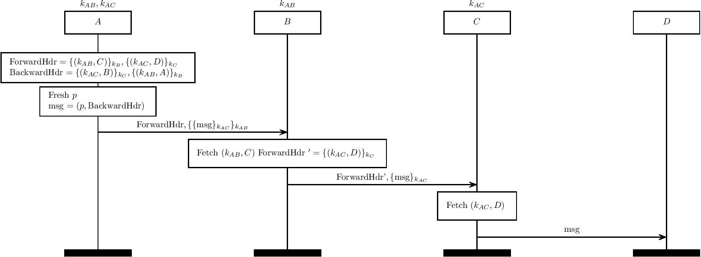

High-speed Onion Routing at the NETwork layer (HORNET)
======================================================

HORNET (citation [40]] in our paper) aims to guarantee privacy by utilizing
onion routing at the network layer, while achieving scalability by removing
state on the relays.

</img>

The above diagram describes the intended data transmission procedure.

After the circuit establishment procedure, each intermediate agent maintains a shared encryption key with the initiating agent. During the record phase, the initiating agent includes to each agent a per-hop packet (here, ForwardHdr) which includes the identity of the next agent in the chain.

The initiating agent also includes a BackwardHdr, indicating desired routing data for the return path.