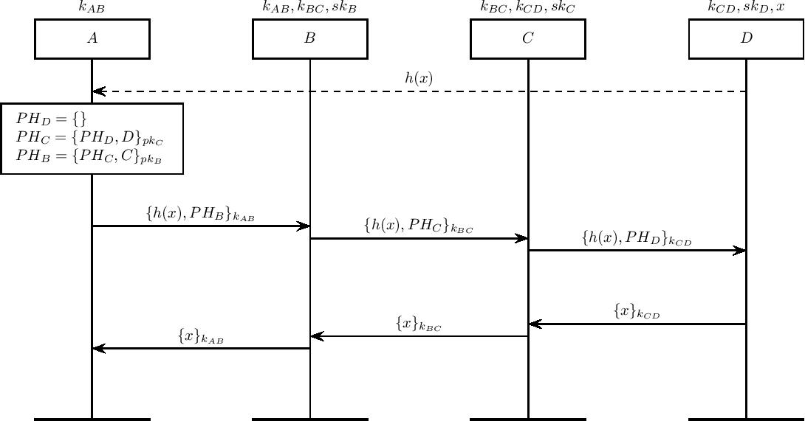

Lightning Payment Protocol
=========================

Our model for the lightning payment protocol. This protocol makes use of Sphinx packets to deliver per-hop routing data to each intermediate agent. Unlike traditional mixnet protocols, agents are able to read the body of the message. On the forwards journey, this is the hashed value h(x), corresponding to the payment invoice that agents use to establish HTLCs.

On the return journey, the inverted hash x allows agents to redeem the opened HTLCs.