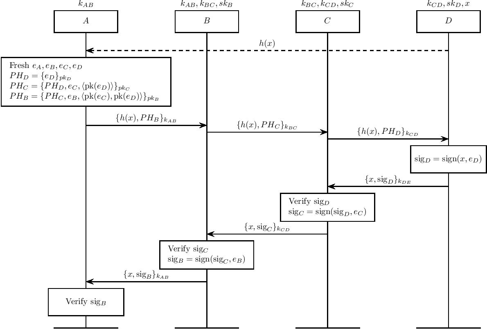

Lightning "Signature" Payment Protocol
=========================

Proposed extension to the lightning payment protocol. We augment the per-hop payloads in the forward leg of the journey with ephemeral keys that are assigned to each agent.

The HTLC redemption is made conditional upon validating a series of signatures made using these keys.

For modelling reasons, we abstract signature verification on the return journey into a single step for each agent, by allowing agents to directly append a key to a signature. In practice this could done in a multi-step process.