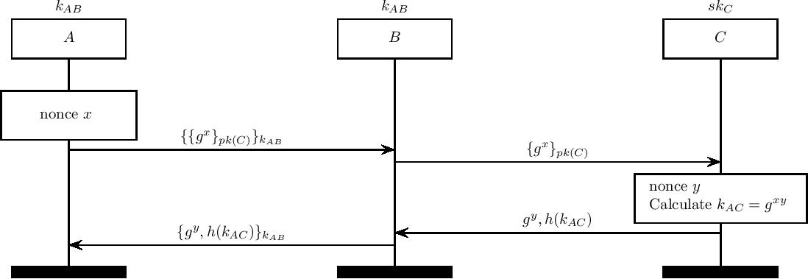

The TOR Circuit Establishment Protocol
==============================

TOR (citation [8] in our paper) aims to guarantee privacy by utilizing
onion routing. This uses symmetric encryption through existing circuits for the majority of the route, with the final hop using asymmetric encryption.

</img>

During the TOR establishment protocol, a client A establishes a shared key with
a TOR relay C by using a Diffie Hellman key exchange. This is done via an existing relay, B.

In this case we assume that A has already successfully established a circuit with agent B.