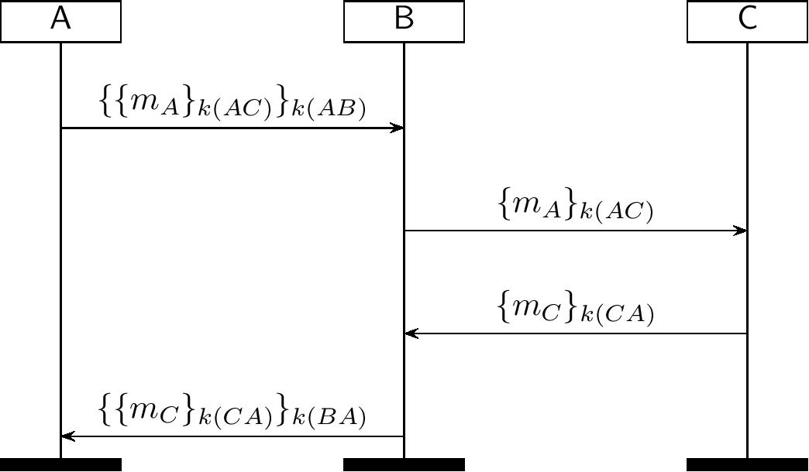

The TOR Record Protocol
=======================

</img>

TOR (citation [8] in our paper) aims to guarantee privacy by utilizing
onion routing.

After the TOR circuit establishment protocol, all the entities maintain
a state containing their symmetric keys and routing information, identified 
by a connection ID. The initiating agent uses chained symmetric encryption to wrap a message to be sent to the endpoint.