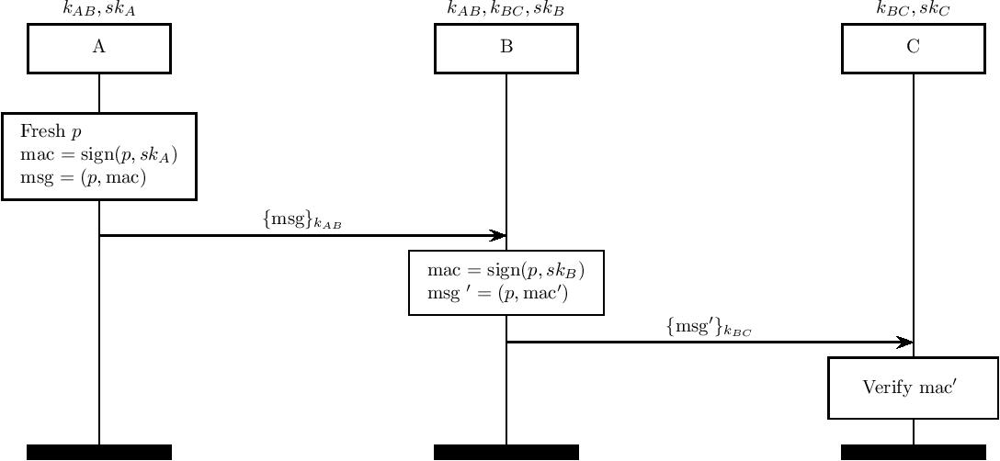

# maTLS Protocol
===========

A model for the maTLS middlebox-enhanced TLS scheme. We examine only the record phase, assuming that the handshake has successfully completed.

The maTLS protocol assigns agents with "accountability keys" that they use to form a chain of hashes on the message as it travels. The receiving party can then travel through the chain of hashes to confirm that the correct path was indeed followed.

For consistency reasons in our model we model HMACs as signatures. Our current model does not consider the case of message modification in-flight (which is one of the considerations of maTLS). 