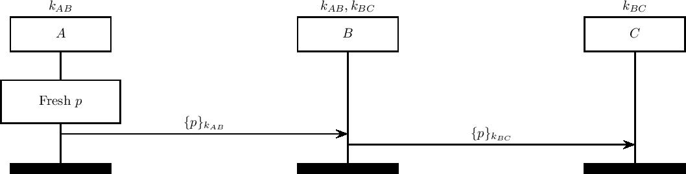

# mbTLS Protocol
===========

A model for the mbTLS middlebox-enhanced TLS scheme. We examine only the record phase, assuming that the handshake has successfully completed.

In the mbTLS protocol, the endpoints assign segment keys to each of the intermediate parties. These parties are then expected to forward the message along this pre-determined series of segments.

As discussed in our submission, we claim that under the Dolev-Yao attacker, this protocol admits a message-skipping attack in the case that two colluding agents forward a message through an off-band channel.