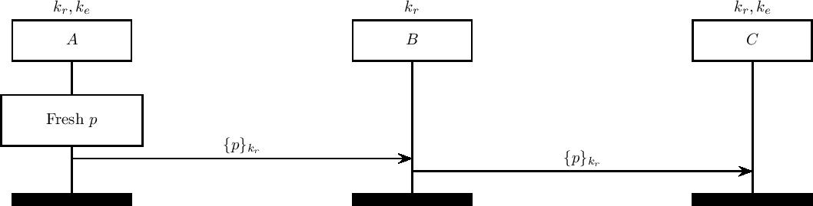

Multi-context TLS (mcTLS)
=========================

Multi-context TLS (mcTLS) (citation [6] in our paper) aims to introduce 
middleboxes while assigning them specific permissions.

Agents can be given either 'read', 'write' or 'endpoint' permissions. They are given keys corresponding to each of their permissions, rather than having per-segment keys.

During the record phase, agents with read permissions forward the message as normal. Agents with write permissions are able to use their write key to modify a MAC appended with the message.

For our model we consider the case of agents with only read permissions. We claim that this protocol exhibits an attack on path integrity in the Dolev-Yao setting: reuse of keys means that an adversary can reroute a message, skipping agents.